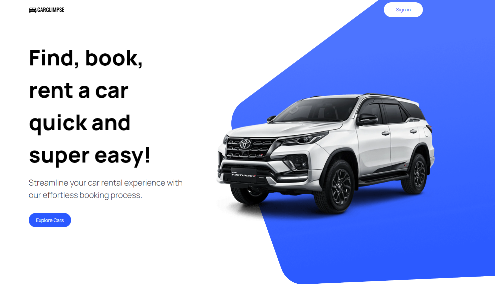

## Table of contents
* [General info](#general-info)
* [Technologies](#technologies)
* [Setup](#setup)
* [Demo](#demo)

## General info
This application is a Car Showcase app built using Next.js, [Cars by API-Ninjas](https://rapidapi.com/apininjas/api/cars-by-api-ninjas) API, Tailwind CSS. 
Features: Explore, rent cars, car details, serach filters.


## Technologies
Project is created with:
* Next.js
* Cars by API-Ninjas API
* Tailwind CSS
	
## Setup
To run this project locally:
```
$ npm install
$ npm run dev
```

Open http://localhost:3000/ to view client in your browser.

## Demo
Vist [CarGlimpse]()